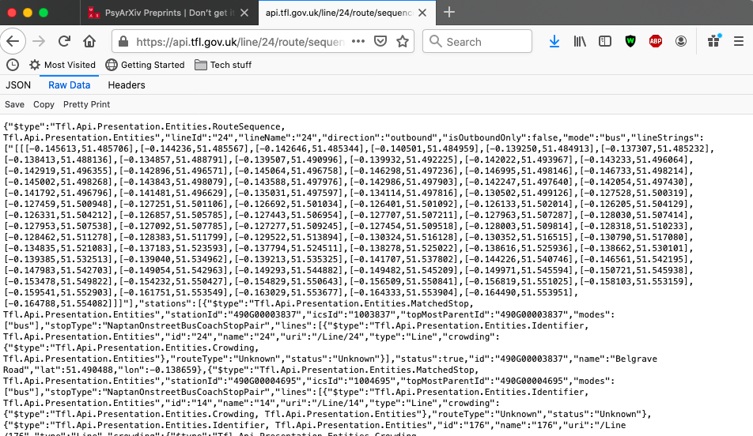

```{r setup, include=FALSE}
knitr::opts_chunk$set(echo = TRUE, message = F, warning = F)
library(jsonlite)
library(osmdata)
library(ggplot2)
library(sf)
library(readr)
library(dplyr)
library(tidyr)
```

# Introduction

Access to most data sets have traditionally been restricted to those who have the means to collect these themselves or to pay for, or otherwise gain access to them. Even when access is granted, this is often with conditions that circumscribe how the data can be used through licensing or policy [@kitchin2014data]. This lead to unequal access to data and the subsequent insight that can be attained from them. 


Open data are a response to these restrictions, seeking to open up data without restrictions, to broaden access and participation in research deriving insight from all sorts of data sets, removing the need to ask permission or negotiate access [@manovich2011trending]. Not only that, but using open data can lead to all sorts of novel insight within the domain of criminology and crime analysis specifically by tapping into constructs and processes difficult to capture through surveys, interviews, and other traditional measures [@solymosi2018role]. Therefore, it is important that social scientists, researchers, crime analysts, and others interested in making sense of the social world around them have the skills and know-how to access and accurately interpret, assess and analyse such data sets. 


This chapter aims to lay the groundwork for developing such skills, providing both a framework to approach and meainingfully interpret open data regarding understanding its origin and any limitations associated with that, and a practical hands-on guide to accessing, wrangling, and analysting open data to draw conclusions about crime and place. We achieve this by first giving a background on open data, discussing the key types of open data out there, critically assessing the strengths and limiations of open data, and building a how-to guide checklist for researchers to follow when approaching an open data source. Finally, we work through an example that shows how to access, wrangle, link, and interpret open data from various sources, providing a template to follow. 


- Prerequisites (reference _Geocomputation with R_).

# Background

## What is open data?

What do we mean when we refer to **open data**? According to @dietrich2009open in the Open Data Handbook, open data is "data that can be freely used, re-used and redistributed by anyone - subject only, at most, to the requirement to attribute and sharealike."


They summarise the content of the Open Definition document published by the @knowledge2016open into three key tenants of open data: 

- **Availability and Access:** the data must be available in the publica domain, accessible at no more than a reasonable reproduction cost. It should be in a machine readable form that is easily accessed and modified. For example, it should be downloadable as a spreadsheet, or json file, rather than presented as a summary table in a PDF document. 
- **Re-use and Redistribution:** the data must be provided under terms that allow free use, including modification, separation, or compilation of the data. permit re-use and redistribution including the intermixing with other datasets.
- **Universal Participation:** everyone must be able to use, re-use and redistribute the data and its derivatives without restriction (eg: 'non-commercia' restrictions or use in education purposes only) 


---
In short, open data should be data that is available in a useful format for analysis that can be used by anyone for any purpose. 
---


Open data practices vary within and between countires. For example, the United States of America have a history of making public sector data sets available, while the United Kingdom is much more strict in releasing their data under a licence or for a fee [@kitchin2014data]. The Global Open Data Index [@globopendata] is one tool for tracking the annual global benchmark for publication of open government data by countries, providing a rank which shows how well governments across the world follow open data practices.


## What are types of open data?

Here we formulate a typology of open data sets based on their origin. 

### Public sector (including publicly funded research)

Much of the open data movement has focused on data generated by state agencies (often termed public sector information) or publicly funded research, given that these have been funded by the public purse for the public's benefit  [@kitchin2014data]. For example, the Global Open Data Index introduced earlier focuses specifically on governmental bodies' data publishers, identifying data gaps in these organisations, and promoting them to think about how to make their data more useable and eventually more impactful [@globopendata]. This is important as open public sector data can be .... 

<!-- MORE HERE basically the paragraph above should really say what is public sector data, why its important (ie what can we do with it as researhcers) -->


Regarding opening up research data, the argument focuses not only on the need to make open data where its collection was funded by public funds, but also on the need for transparency and reproducibility. Replication is a hallmark of such open science practice, and opening up data sets used in publications in criminology and wider social sciences contributes to foster a culture of replication [@pridemore2018replication]. Open data and replications fit into the wider discourse in social sciences around open data, open review and open dialogue, which may even become (with time) policy requirements regardless of the research funding source [@vuong2017open]. There are repositories where open research data is available (osf.io, uk data service, others??). 

<!-- Somehow I want to also say "keep in mind open research practices when collecting your own data, although we dont cover how to actually release and make open your own data in this chapter, read more about this somewhere... idk? -->


### Private sector

A more limited focus of open data activists lays on  opening up data generated by private industry, which might have more proprietary value to its creators [@kitchin2014data]. While datasets are released by private sector companies, they often are only a subset selected by the organisation. However they might still provide valuable insight. Indeed many interesting papers have been written using the data released by large private sector organisations such as Google [@stephens2017everybody], Instagram [@reece2017instagram], Uber [@davidson2017interactive] and many more. In another chapter in this book you will learn to use the free Twitter API to do just the same (see Nick and Dan's chapter link to that). 


### Open crowdsourced data

Finally, there is a specific group of open data sources that collate data collectively generated by large groups of individuals who do not specifically belong to any organisation, but instead work together on a collaborative project. These are crowdsourced data sets. Examples include Wikipedia (www.wikipedia.org), an online encyclopedia where anyone can contribute, and Flickr (www.flickr.com) an online photo gallery where anyone can upload and tag their photos. Often the organisations who maintain and monitor these data collection activities are charities or non govermental organisations that operate not for profit, but instead to provide some sort of social good. An example is the online problem reportin platform fixmystreet, where people report instances of graffiti or other environmental complaints, which can offer insight into people's experiences with incivilities [@solymosi2018crowdsourcing]. Another chapter in this book (REF CHAPTER WITH DAVID) discusses the merits and pitfalls of crowdsourced data, and what to watch out for when analysing open data of this type. 
  
  
## What are strengths and limitations


Each one of the above categories might have its own strengths and limitations, and it is very important to consdier the source of the data you are working with, and what might mean for what and who is represented or excluded from these data. Here we will provide a general overview, and some guidance on how to make sure you take all necessary precautions when analysing open data of any kind. 


Open data is hailed for its ease of use afforded by its availability and access; there is no need to ask for permissions or negotiate data access in order to use it for research [@manovich2011trending]. In this sense, the great advantage of this data is that it is already out there. To collect it, all that is needed is a way to be able to interpret what this data means (for example by applying a framework for its analysis), and some skill in data scraping, wrangling and cleaning, in order to be able to transform it into a usable format for research [@boyd2012critical]. 


But besides being easy to access, there are further advantages to using such data. One specific motivation for using open data comes from its potential to address many limitations associated with traditional surveying methods, such as social desirability bias, or issues associated with memory and recall [@mayer2013big]. By generating data often as a byproduct of other activities, we might gain more honest insight into people's everyday lives and associated social processes [@solymosi2018role]. At the same time, there are new threats to validity that may emerge in these sorts of data, and researchers should be careful in interpreting people's communication online as authentic [@manovich2011trending].


A related, and key concern about these dara relates to issues about sampling, and ultimately the generalisability of any findings that can be drawn from them. In the case of crowdsourced data, where the sample of the population who contributes to such data is self-selected, giving way for people more motivated to speak about the issue, which means the data are likely to contain inherent bias [@longley2012geodemographics]. Specifically it tends to be men, between ages of 20-50, with a college or university degree who are most likely contributors [@budhathoki2010participants; @haklay2010good]. 


Looking into what contextual factors influence participation in Open Street Map, @mashhadi2013putting found that, socio-economic factors such as population density, dynamic population, distance from the centre and poverty all play an important role. These are important to keep in mind when reporting findings based on analysis of such data.


Despite these limitation, the social sciences must embrace these new forms of data that, although messy, biased and noisy, have the potential to describe social phenomena better than well-organized small surveys or even national censuses [@savage2007coming]. The inclusion of crowdsourced data which are both up-to-date and specific to the problem at hand can still provide new insight in addition to the knowledge from established sources of data collected in traditional methods [@birkin2011calibration]. All of this helps us to understand the relations between the events and the occurrences that come together in unique places and provides a framework for understanding how places change over different time periods [@longley2012geodemographics].


---

In sum, researchers and analysts using open data must first ask critical questions about: 

- **where** does this data come from? 
- **why** was the data collected in the first place?
- **who** is represented in the data, and who is excluded?
- **what** concepts and constructs can and cannot be operationalised with this data?
- **when** did data collection take place, and how might have that influenced results?

And meaningfully engage with the answers to these questions during conceptualisation and operationalisation phases of any research project. 

---


# Practical exercise

In this exercise we will demonstrate: 

- how to access open data using Application Programming Interfaces (APIs) and through downloading from official sites
- an example of how to clean and wrangle data for analysis
- how to link distinct data sets
- how open data from different sources may tell us different things, and why engaging with the critical questions outline above is crucial to properly use open data in research and analysis. 


## Our aim

We are interested in finding out how bus stops might affect crime. 

<!-- more about link between bus stops and crime here maybe something from Andy Newton/Vania Ceccato/ Anastasia Loukatou-Sideris/me -->


## Accessing data

We will be using two different types of open data in this exercise, public sector data (crime data and transport authority data) and crowdsourced data (from Open Street Map). To access them we will use three different methods: 1) Direct download, 2) Direct request to an API, 3) Request to an API using a wrapper. This will give you few different ideas about how you might go about accessing other open data sets relevant to your research. 

### Direct download

The simplest way that open data is often made available is through direct download from a website. This is the case for open police data made available in the United Kingdom through the [data.police.uk](https://data.police.uk/) webportal. To access this data, simply type the url into any web browser ( [https://data.police.uk/](https://data.police.uk/) ), and follow the guidance to acquire data. In the case of police.uk you [select the tab which says "Data"](https://data.police.uk/data/), choose your "Date range:" (ie for what months you would like to download crime data for), choose the police forces you want crime data from, choose some options (whether you want to include crime data, outcomes data, and/or stop and search data) and click on 'Generate File' to download. 

Once you download this data you will have to save this locally on your computer. We have saved ours in a subfolder called "data" and will be loading the data into R directly from there. 

Some data downloads may come bundled with a data dictionary, explaining important information about your data set, which you will need to answer the critical questions outlined in previous sections. In other cases this might be found online. This is the case with the police.uk dataset, where the data dictionary can be found on the ["About" page](https://data.police.uk/about/). Make sure you always read through this correctly so you can answer your critical questions and fully understand your data set. 

### Direct request to an API

An application programming interface (API) is a tool which defines an interface for a programme to interact with a software component or system, for example, what sort of requests or calls can be made to it, and how these can be made. We are specifically using the term APIs to denote tools created by an open data provider to provide access to different subsets of their content. APIs facilitate scripted and programmatic extraction of content, as permitted by the API provider [@olmedilla2016harvesting]. APIs can take many different forms and be of varying quality and usefulness [@foster2016big]. For the purposes of accessing open data from the web, we are specifically talking about **RESTful APIs**. REST stands for Representational State Transfer. These APIs work directly over the web, meaning that we as users can play with the API with relative ease to understand how it works [@foster2016big].

Here we will use the example of the British transit authority Transport for London (TfL) to practice constructing HTTP requests via their API, and then parsing the data that are returned. Much like how downloading data directly requires access to a data dictionary to make sense of the data and answer our critical questions, we must find a similar document to understand how the API we plan on using works. In the case of the TfL API this is provided via the [TfL Open Data page for their unified API](https://tfl.gov.uk/info-for/open-data-users/unified-api) and the [documentation page](https://api-portal.tfl.gov.uk/docs). We will engage more with this in the exercises. 


### Request to an API using a wrapper

Often developers who work with APIs will share their code for doing so, and release them in the form of a package or module. This is called a **wrapper** because it's code that wraps the API in a nice package, making it easier for future users to access. The wrapper can take many forms, it could be a Python module, or an R package, or it can even be a web interface that provides a graphical user interface (GUI) for accessing the API in question. 

To demonstrate this, we will be accessing data from Open Street Map (OSM). OpenStreetMap is a crowdsourced open data set of spatial information built by a community of mappers that contribute and maintain data about all sorts of environmental features, such as roads, trails, cafes, railway stations, and much more, all over the world. The result is a map rich in local knowledge, which prvides valuable information about places and their features. 

OSM has two types of wrappers available for its API, a web-based GUI called [Overpass Turbo](https://overpass-turbo.eu/), and an R package called `osmdata`. We will explore using both. 


<!-- ### Open Street Map -->


<!-- #### What is Open Street Map? -->

<!-- - Brief history. -->
<!-- - Motivations for and advantages of an open web mapping platform. -->
<!-- - Primary features (keys, values, elements). -->
<!-- - Contributing to the data yourself. -->

<!-- ### data.police.uk -->

<!-- ### Transport for London Open Data Portal -->


<!-- ### Downloading Open Street Map Data -->

<!-- - Define and explain APIs. -->
<!-- - For OSM, describe overpass queries and overpass-turbo. -->
<!-- - Query example (brief). -->

<!-- ### Using Open Street Map data in R -->

<!-- - Made easy through the `osmdata` package in R. -->
<!-- - More straightforward than overpass-turbo. -->
<!-- - Compatible with both `sp` and `sf` classes of spatial data. -->
<!-- - We focus on `sf` as its compatible with the `tidyverse`. -->
<!-- - Outline the key documentation and references. -->
 
## Walk-through

Let's get started! Getting back to our problem at hand, crime at bus stops, we want to know how crimes and bus stops interact...
<!-- clear up what research q we can actually answer....!! -->


First, ensure that you have the relevant packages installed in R. Although the main packages used in this demonstration are `rjson` for parsing the TfL API results and `osmdata` for querying the Open Street Map API, we use a number of additional packages for data handling and visualisation. If you don't have these packages installed, use the `install.packages()` function prior to loading each one with `library()`.

```{r, eval = F}
library(jsonlite)
library(osmdata)
library(ggplot2)
library(sf)
library(readr)
library(dplyr)
library(tidyr)
```


Now let's focus on acquiring our different data sets


### Direct Dowload of crime data

<!-- IDK how much detail we actually need here, probably not loads, about downloading extracting and importing police.uk data -->


### Direct request to TfL API


Our first step is to read through the . The tells us what sort of data is possible to acquire. We know that currently we want to find the location of bus stops, and any information that is available from TfL about these bus stops. In the documentation is where we find specifically *how* we can request this. 


Specifically, we can scroll down to where we find "". Next to this we see the example URL: `https://api.tfl.gov.uk/line/24/route/sequence/outbound` This example demonstrates how we can request this information, and gives us a template to alter, but also allows us to take a peak into the result this call will return. 


To see, try to take the above URL, and copy and paste it into your browser window. What do you see? It should be something like this: 





This contains the information we requested (bus route 24 stops outbound) in a format called **JSON**, which stands for JavaScript Object Notation. JSON is an open standard way of storing and exchanging data, and will most likely be the format in which data are returned from most API calls. 


Great, but how do we get this into R? Well this is where the `rjson` package is handy, and specifically we can use the `fromJSON()` function to parse this JSON p=object, which we can read directly from the URL into R using the `readLines()` function (base R). So, if we wanted the results of the bus route 24, we would type: 


```{r getrt24}

api_call <- fromJSON(readLines("https://api.tfl.gov.uk/line/24/route/sequence/outbound"))

```


This gives us an object (`api_call`) which contains all the information returned by the TfL API. Now JSON is slightly different to dataframes which we are more used to dealing with, in that there is nested information 


```{r conferttodf}

json_data_frame <- as.data.frame(api_call)

```


<!-- insert here tutorial on parsing the api data, this is a job for next week i'm tired -->

### Using wrappers to access Open Street Map data

<!-- Maybe start with the GUI-based one, and then do the below in R? -->

All queries begin with a bounding box specification to define the study region. This can be obtained manually, which requires some existing knowledge about an area using the latitude and longitude coordinates, but it is generally easier to use a search term. Here, we select Greater London in the United Kingdom using the `getbb()` function, specifying that we want the content as a simple features (sf) polygon.

```{r}
bb_sf <- getbb(place_name = "greater london united kingdom", format_out = "sf_polygon")
```

We now have our study region defined as the administrative boundaries of Greater London. This can be visualised using `ggplot2` and the _simple features_ geometry `geom_sf()` available with `sf`. Note that by default, the Coordinate Reference System (CRS) is the World Geodetic System 84.

```{r}
ggplot(data = bb_sf) +
  geom_sf()
```

Now we have our study region, we can scrape data from the OSM API using the `opq()` function, which is short for 'Overpass query'. This allows you to build an Overpass query, outlined in the previous section, from within the R environment. We specify the bounding box object which is our study area, and pass this through using a pipe `%>%` to `add_osm_feature()` in which we define what we want to pull from the API. As we noted earlier, features in OSM have are defined through keys and values. Here, we specify that we want amenities (the key) defined as bicycle parking (the value). This query is then piped through to `osmdata_sf()` which ensures that the resulting object is a _simple features_ class for easy plotting with `ggplot2`. We trim the features pulled from the API using `tim_osmdata()` to ensure that everything stays within the boundaries of our study region.

```{r}
bikes_sf <- opq(bbox = bb_sf) %>%                                 # select bounding box
  add_osm_feature(key = 'amenity', value = 'bicycle_parking') %>% # select features
  osmdata_sf() %>%                                                # specify class
  trim_osmdata(bb_poly = bb_sf)                                   # trim to region
```

The resulting object `bikes_sf` contains lots of information. We can view the contents of the object by simply executing the object name into the Console.

```{r}
bikes_sf
```

This confirms details like the bounding box, but also provides information on the simple features collected from the query. As one might expect, most information relating to bicycle parking has been recorded using points (i.e. two-dimensional vertices, coordinates) of which we have over seven thousand at the time of writing. We also have around one hundred polygons. For now, let's extract the point information only and then transform the CRS to the BNG.

```{r}
bikes_points_sf <- bikes_sf$osm_points 
```

We can then plot these points over our original boundaries of Greater London. We reduce the default size of the point to ensure that we avoid too much overlap between bicycle parking locations.

```{r}
ggplot() +
  geom_sf(data = bb_sf) +
  geom_sf(data = bikes_points_sf, size = 0.3)
```

As we can see, most bicycle parking spaces are clustered around the city centre, especially just north of the river Thames. It is also possible to make out key roads flowing in and out of the city centre, which contain bicycle parking all along the street.

Using open police recorded crime data we can then plot actual incidences of bicycle theft to explore whether there is a spatial relationship between bike theft and parking spots in Greater London. For this example, we just use crime recorded as occurring in January 2020. First, let's load in the data as it downloaded raw from https://data.police.uk/data/.

```{r}
crime.df <- read_csv("data/2020-01-metropolitan-street.csv")
```

We then need to conduct a bit of preliminary data handling: filter crimes which were tagged as bicycle theft, convert the latitude and longitude columns to coordinates with _simple features_, state the WGS 84 CRS and then clip the points by our study region.

```{r}
bike.crime.sf <- crime.df %>% 
  filter(`Crime type` == "Bicycle theft") %>% 
  drop_na(Longitude, Latitude) %>% 
  st_as_sf(coords = c(x = "Longitude", y = "Latitude"), crs = 4326) %>% 
  st_intersection(bb_sf)
```

To demonstrate the data in its entirety, we can plot the Greater London boundaries, overlayed with the bicycle parking space locations, and open crime data about bicycle thefts. It is worth clarifying that open police recorded crime data in England and Wales is spatially anonymised by a process of snapping points to a pre-defined grid (see @tompson2015uk). For that reason, many of these points overlap, and thus a degree of transparency is used for the points.

```{r}
ggplot() +
  geom_sf(data = bb_sf) +
  geom_sf(data = bikes_points_sf, aes(colour = "bike_park"), size = 0.4, alpha = 0.5) +
  geom_sf(data = bike.crime.sf, aes(colour = "bike_crime"), size = 0.3, alpha = 0.5) +
  scale_colour_manual(name = NULL, values = c(bike_park = "black", bike_crime = "red")) +
  theme(legend.position = "bottom")
```

### Bus stop example

```{r}
bus_sf <- opq(bbox = bb_sf) %>%                                 # select bounding box
  add_osm_feature(key = 'highway', value = 'bus_stop') %>%      # select features
  osmdata_sf() %>%                                              # specify class
  trim_osmdata(bb_poly = bb_sf)  
```

## Future of open data

- Threats to its sustainability (e.g. licence expiry).
- Prospects in crime of place research.
- Examples of cool projects (e.g. Colouring London).
- Suggestions for new avenues which can expand the field.

## Conclusion

- Re-cap on what we've covered.
- Wrap-up the key points.

# References
