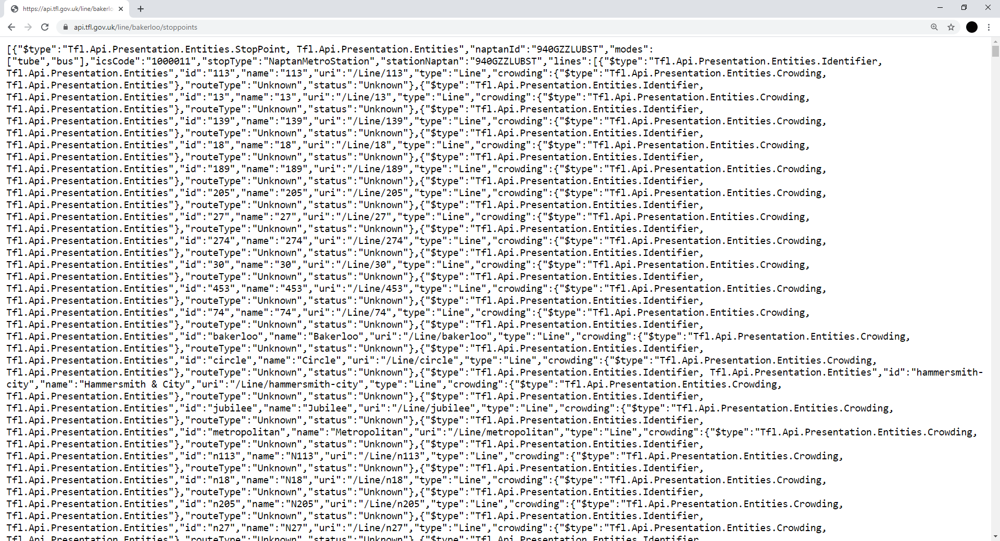

```{r setup, include=FALSE}
knitr::opts_chunk$set(echo = T, message = F, warning = F)
library(jsonlite)
library(osmdata)
library(ggplot2)
library(sf)
library(readr)
library(dplyr)
library(tidyr)
library(patchwork)
```

# Introduction

Access to data in crime and place research, and even criminology more broadly, has traditionally been reserved for those who have the means to collect fresh data themselves, pay for access, or obtain data through formal data sharing agreements. Even when access is granted, the usage of these data often comes with conditions that circumscribe how the data can be used through licensing or policy [@kitchin2014data]. The public dissemination of findings which emerge from analysis might even be subject to restrictions. This can lead to unequal access, controlled usage and curb the diffusion of findings, severely limiting the insight that can be attained from data.

Open data are a response to these shortcomings, broadening access and participation in research, removing the requirement for permissions, formal agreements and negotiations [@manovich2011trending]. Not only this, but open data can also lead to all sorts of novel insight within crime and place research, tapping into constructs and processes which are difficult to capture through surveys, interviews and other traditional measures [@solymosi2018role]. As such, it is important that social scientists, researchers, crime analysts, and others interested in making sense of the social world around them have the skills and know-how to access, interpret, critique and analyse open data sets.

This chapter aims to lay the groundwork for developing such skills by providing a framework to approach and meaningfully interpret and engage with open data. The chapter also offers a practical hands-on guide to accessing, wrangling, and analysing different sources of open data in order to draw conclusions about crime and place. We achieve this by first giving a background on open data, discussing the key types of data out there, critically assessing the strengths and limitations of each, and building a how-to guide checklist for researchers to follow when approaching an open data source. Finally, we work through an example that shows how to access, wrangle, link, and interpret open data from various sources, providing a template which can be applied in other research areas.

# Background

## What is open data?

First, it is useful to clarify what we mean when we refer to 'open data'. The _Open Data Handbook_, compiled by the Open Knowledge Foundation, states that open data are "data that can be freely used, re-used and redistributed by anyone - subject only, at most, to the requirement to attribute and sharealike" [@dietrich2009open]. Specifically, open data can be defined along three key domains [@knowledge2016open].

- **Availability and Access:** the data must be accessible via a public domain, at no more than a reasonable reproduction cost, and through a convenient medium, such as the internet. Ideally, it should be machine-readable and modifiable. For example, it should be downloadable from a website as an unlocked spreadsheet, or JSON file, rather than presented as a summary table in a PDF document.
- **Re-use and Redistribution:** the data must be provided under conditions that allow free use, such as modification, separation, or compilation of the data, and permit re-use and redistribution including the intermixing (merging) with other datasets.
- **Universal Participation:** everyone should be allowed to use, re-use and redistribute the data and its derivatives without restriction. For instance, restrictions that only allow non-commercial or educational usage would not constitute open data.

In short, 'open data' should be data that are readily and publicly available, in a usable format, and without restrictions on usage, modification and re-distribution. Open data practices, and the extent to which it is a reality, vary both within and between countries. For example, the United States has a history of making public sector data sets openly available. The United Kingdom can be more strict, releasing data under a licence ('Open Government Licence'), with some data requiring a fee [@kitchin2014data]. The _Global Open Data Index_ [@globopendata] is one tool for tracking the annual global benchmark for publication of open government data by country. It provides a rank which indicates how well governments across the world follow open data practices on aggregate, but also according to specific domains. Many of these have direct relevance to crime and place research, such as administrative boundaries and geographic locations (e.g. coordinates).

## What are types of open data?

Now we have a reasonable idea about what open data is in a broad sense, we can consider the different types of open data which you might come across. Here, we formulate a typology of open data sets based on their origin to help provide an overview.

### Public sector

Much of the open data movement has focused on information generated by local and national state agencies, or publicly funded research. Open data has become a key component of transparency and accountability in government, given that much of the data collected has been funded by the public purse [@kitchin2014data]. In some countries, the national statistics body is independent from government, which serves to improve accountability and increase public trust in the data being collated and published. The _Global Open Data Index_ introduced earlier focuses on identifying the gaps in governmental organizations, encouraging them think about how public sector information can become more usable, and ultimately, more impactful [@globopendata].

As researchers studying crime and place, public sector data is particularly important. Many variables thought to explain the non-random distribution of crime, offenders and victims in space are collated and published by governmental bodies. For instance, demographic characteristics about resident populations can be collected via national censuses, with data usually released at aggregations which constitute 'neighborhoods' - a theoretically important scale in criminology. Data describing urban structure, such as street networks, are often generated and distributed by public bodies, and can be used in street syntax analysis to assess whether the configuration of streets dictates things like violent crime victimisation [@streetsyntax2017]. In many countries, representative victimisation surveys are openly available for download. This is not only useful for substantive research (e.g. quantifying long-term crime trends), but also scrutiny over reliability and accuracy in other forms of open data, such as police recorded crime records. Both of these examples represent an interesting challenge to open data principles, since data tends to be anonymised to some degree before being made available to the public. Access to the raw records is dependent on a number of requirements (e.g. background checks, contractual agreements, ICT security measures) which might exclude many individuals due to cost and practicality.

The drive towards transparency and scrutiny of public information is further enhanced by an increasing need for replication - a hallmark for open science research practice. Opening up data sets used in criminology publications and wider social sciences fosters and facilitates a culture of replication [@pridemore2018replication]. As such, open data fits into the wider discourse around transparency, open review and open scrutiny, which (in time) may even become a policy requirement irrespective of the research field or the source of funding [@vuong2017open]. Increasingly, researchers are making use of online repositories for their papers (e.g. https://osf.io/), data (e.g. https://www.ukdataservice.ac.uk/deposit-data) and code (e.g. https://github.com/), all in the name of transparency and replication. These are guidelines and tools worth considering, not just when conducting analysis on secondary data sources, but also collecting and sharing your own data.

### Private sector

Opening up data generated by the private sector represents a significant challenge, largely due to the proprietary value to its creators [@kitchin2014data]. The aims and objectives of private companies, who have a duty to shareholders and operate in a competitive market environment, differ considerably from local and central government. That said, some datasets are released openly by private sector organizations, albeit often only a subset of what would be available as a paying customer. The website for ArcGIS, a piece of software maintained by the Environmental Systems Research Institute (ESRI), a private company, host a number of open geographic datasets on their online cloud platform (https://hub.arcgis.com/search). Indeed, many papers have made use of data collected or distributed by private organizations to explore crime and place, such as Google Street View images [@langton2017residential] and Twitter [@malleson2015impact]. In fact, you will learn to use the free Twitter API for such purposes in this book (see Chapter 6, Topic 7).

### Open crowdsourced data

Finally, there is a specific group of open data sources that collate data collectively, generated by large groups of individuals who do not specifically belong to any organization, but instead work together on a collaborative project. These are crowdsourced data sets. Examples include Wikipedia (https://www.wikipedia.org/), an online encyclopedia where anyone can contribute, and Flickr (https://www.flickr.com/) an online photo gallery where people can upload and tag their photos. Often, the organizations who maintain and monitor these data collection activities are charities or non-governmental organizations that do not operate for profit, but instead provide some form of social good. An example is the online reporting platform FixMyStreet (https://www.fixmystreet.com/), where people can report problems such as instances of graffiti, vandalism or environment issues. The data has been used to explore signal crimes theory, for instance, offering insight into people's experiences with incivilities [@solymosi2018crowdsourcing]. Another topic in this book (see Chapter 6, Topic 6) discusses the merits and pitfalls of crowdsourced data, and what to watch out for when analysing open data of this type.
  
## Strengths and limitations

The defining characteristics of open data, namely, that of availability, re-usability and universal participation, outlined earlier, represent its greatest strength. But besides from this, there are other advantages. One specific motivation for using open data comes from its potential to address many of the limitations associated with traditional surveying methods, such as social desirability bias, or issues associated with memory and recall [@mayer2013big]. This advantage exists largely due to the organic way in which open data is generated. It is often a by-product of other activities, and as such, we can gain an honest insight into people's everyday lives and associated social processes [@solymosi2018role]. As noted, open data also means open research, facilitating transparency and reproducibility. That said, there are a number of shortcomings which are worthy of consideration.

Firstly, one of the biggest obstacles to collecting open data is the ability to interpret what the data means (e.g. applying a framework for its analysis), and computational skills in data scraping, wrangling and cleaning, in order to transform it into a usable format for research [@boyd2012critical]. All sorts of open data remain unanalyzed, and or inaccessible, to large portions of the population, simply because they lack the skills and know-how. Although this is certainly an obstacle for data usage more generally, it represents a key challenge to governmental bodies, in particular, on which there is an onus to ensure transparency and facilitate scrutiny. Private companies, especially those who generate open data as a by-product of their primary activity (e.g. Twitter), have little responsibility or pressure to ensure that their data is accessible and usable to the general public. Moreover, in both public and private spheres, licences and conditions on open data are not necessarily concrete, and might be subject to change with little or no notice. This is an important consideration when planning and running long-term research projects.

Secondly, despite the merits of open data in terms of remedying pitfalls in traditional survey methods, there are other threats to validity that may emerge. For instance, whilst many online resources offer an 'honest' depiction of society, uncaptured by surveys, researchers should be careful in interpreting people's communication online as completely authentic [@manovich2011trending]. This could be a result of individuals willingly managing and 'curating' their online presence [@ellison2006managing], or because of wider issues such as government censorship, or cultural norms around particular topics such as sexual assault. Relatedly, researchers should be aware of issues over sampling, and ultimately, the generalizability of findings that emerge from the analysis of open data. In the case of crowdsourced data, the sample is not randomly drawn from a population, but rather, it is self-selected, giving way for people willing to discuss or contribute to a particular issue, which introduces a degree of bias [@longley2012geodemographics]. Specifically, contributors tend to be men, between the ages of 20-50, with a college or university degree [@budhathoki2010participants; @haklay2010good]. Contributions to resources such as Open Street Map, which we look at in the practical exercise later, are correlated with contextual characteristics such as poverty and population density, and as such, coverage is non-uniformly distributed across urban areas [@mashhadi2013putting]. These are important to keep in mind (and be transparent about) when reporting findings based on analysis of such data.

Open data can be messy, biased and noisey, but criminology (and social sciences more generally) can benefit immeasurably from its use. Only through open data can public sector bodies be held to account, research be transparent and reproducible, and participation in data analysis universal. In crime and place research, both dependent variables (e.g. police recorded crime incidents, victimization rates) and independent variables (e.g. demographic characteristics, ambient population estimates) can be sourced from open data, whether public, private or crowdsourced. With a critical, engaged and considered approach to conducting research with open data, criminology can become a leading force in open and reproducible social science. In sum, researchers and analysts using open data must first ask critical questions:

- **Where** does this data come from? 
- **Why** was the data collected in the first place?
- **Who** is represented in the data, and who is excluded?
- **What** concepts and constructs can and cannot be operationalized with this data?
- **When** did data collection take place, and how might have that influenced results?

With this in mind, the following exercise utilizes mutliple sources of open data on public transport and police recorded crime in London, England, to explore crime and place.

# Practical exercise

In this exercise we will demonstrate a number of different skills, including:

- Accessing open data using direct downloads and Application Programming Interfaces (APIs).
- Cleaning and wrangling data for analysis.
- Visualizing open spatial data.
- Comparing different sources of open data.
- Engaging with the critical questions outline above to better understand open data.

## Our aim

In demonstrating these skills, we will be answering two key research questions. The first is a substantive empirical investigation into crime in and around London Underground stations, in the spirit of existing research into transport crime (see newton2014above). Studies in Sweden, for instance, have shown the importance of environmental and neighborhood characteristics in determining crime concentrations at underground stations in Stockholm, along with the positioning of stations on the line [@ceccato2013security]. Investigations have also taken place into crime concentrations at bus stops in Los Angeles [@loukaitou1999hot] and the impact of intensive policing along bus corridors in Merseyside, England [@newton2004crime], amongst others. As such, we can pose the following research question:

- RQ1: To what extent does crime cluster in and around London Underground stations?

The second is more methodological, and relates to our considered and critical usage of open data, by exploring the validity of different open data sources. As such, we can pose:

- RQ2: How comparable are public sector and crowdsourced open data on London underground stations?

First, we will go through how to access the open data used in the exercises.

## Accessing data

We will be using two different types of open data in this exercise: public sector data (police recorded crime data and local transport authority data) and crowdsourced data (from Open Street Map). To access them we will use three different methods, namely, (1) direct download, (2) direct request to an API, 3) request to an API using a wrapper. This will give you a few different ideas about how you might go about accessing other open data sets relevant to your research. Locating, identifying and learning to access open data is a skill in itself.

### Direct download

The simplest way that open data can be made available is through direct download from a website. This is the case for open police recorded crime data in England and Wales. It can be accessed and downloaded using an online web portal (https://data.police.uk/) under Open Government Licence. Using the "Data" tab, anyone from researchers to members of the public can select the time period and police force of interest, and the type of information required (e.g. crimes, stop and search, outcomes), and then "Generate file" to create a download link. Data is downloaded in  comma-separated values format (.csv file extension). The website also contains detailed information about data quality, downloads and tools under the "About" tab, which is particularly useful when considering the critical questions posed earlier (where, why, who, what, when). For this exercise, we are going to use British Transport Police data, a force which operates on railways and light-rail systems across the country, for the month of January in 2020. Select the time period using the dropdown menus, the force using the tickboxes, and then generate and download the file. We save this file locally to a subfolder named "data", and during the exercise, the data is loaded into R from this folder.

### Direct request to an API

Another way of downloading open data is through an application programming interface (API). This is a tool which defines an interface for a program to interact with a software component or system, for example, what sort of requests or calls can be made to it, and how these can be made. Here, we are using the term 'API' to denote tools created by an open data provider to give access to different subsets of their content. APIs facilitate scripted and programmatic extraction of content, as permitted by the API provider [@olmedilla2016harvesting]. APIs can take many different forms and be of varying quality and usefulness [@foster2016big]. For the purposes of accessing open data from the web, we are specifically talking about _RESTful_ APIs. The 'REST' stands for Representational State Transfer. These APIs work directly over the web, which means users can play with the API with relative ease in order to understand how it works [@foster2016big].

Here, we will use the example of a local government organization responsible for transport, Transport for London (TfL). One of the main responsibilities of TfL is to oversee various rail networks in Greater London, including the London Underground. We will use open data from TfL to practice how to construct HTTP (i.e. web link) requests via their API, and then parse the data which is returned. Much like how downloading data directly requires access to a data dictionary to make sense of the data (e.g. understanding its origins and flaws), we must find a similar document to understand how the API we plan on using works. Details about the TfL API are provided through their open data page (https://tfl.gov.uk/info-for/open-data-users/unified-api), which explains what data is available, and how the API is designed. Usefully, TfL provide a documentation page with examples of how you can use the HTTP links to make calls to the API (https://api-portal.tfl.gov.uk/docs). We will actually make these calls from within the R environment, but it might be useful (and interesting) to examine how basic queries are constructed using this documentation.

### Request to an API using a wrapper

Often, developers who work with APIs will share their code, and release them in the form of a package or module. This is called a _wrapper_ because it uses code that 'wraps' around the API to make it a neater, more usable package. Wrappers remove (or at least lower) many of the obstacles to accessing open data noted earlier. The wrapper can take many forms, such as a Python module, or an R package. It could even be a web interface that provides a graphical user interface (GUI) for accessing the API in question. 

To demonstrate this, we will be accessing data from Open Street Map, a database of geospatial information built by a community of mappers, enthusiasts and members of the public, who contribute and maintain data about all sorts of environmental features, such as roads, green spaces, restaurants and railway stations, amongst many other things, all over the world. As such, it is a prime example of 'crowdsourced' open data. You can view the information contributed to Open Street Map using their online mapping platform (https://www.openstreetmap.org/). The result of people's contributions is a database of spatial information rich in local knowledge which provides invaluable information about places and their features, without being subject to strict terms on usage. Open Street Map has two types of wrappers available for its API, a web-based GUI called Overpass Turbo (https://overpass-turbo.eu/), and an R package called `osmdata`. We will focus on their usage from within R, as this is a tool used more widely to conduct reproducible research and statistics in criminology.

## Walk-through

So, let's get started. Recall that we are interested in examining the extent to which crime concentrates in and around London Underground stations, but also the contrasts between the open data available via TfL and Open Street Map, as public sector and crowdsourced open data, respectively.

First, ensure that you have the relevant packages installed in R. Although the main packages used in this demonstration are `rjson` for parsing the TfL API results and `osmdata` for querying the Open Street Map API, we use a number of additional packages for data handling and visualization. If you do not have these packages installed, use the `install.packages()` function prior to loading each one with `library()`.

```{r packages}
library(jsonlite) 
library(osmdata)
library(ggplot2)
library(sf)
library(readr)
library(dplyr)
library(tidyr)
library(patchwork)
```

### Direct request to TfL API

Reading through the TfL API documentation mentioned earlier (https://api-portal.tfl.gov.uk/docs), you will get a feel for the kind of data available. To draw conclusions about the degree to which crime occurs in and around London Underground stations, we first need spatial information so we can plot station locations on a map. In the documentation there an 'API area' (which offer some guidance on the types of data available) called _Stops_. We can see that this includes information on bus stops by route (which are numbered e.g. 24), and underground stations by line (which are named e.g. "Bakerloo"). The example for the underground stations is a URL: https://api.tfl.gov.uk/line/bakerloo/stoppoints. This has quite an intuitive structure, since we first want to access the TfL API, look for data by line, select the name of the line we are interested in, and finally pull information about where the train stops. In fact, you can simply copy and paste this URL into your internet browser, and it should look something like Figure 1.

```{r tfl, out.width = "\\textwidth", fig.cap="example of data from Transport for London", echo = F}

```

Although this contains the information we requested, it is in a format called _JSON_. This stands for JavaScript Object Notation. JSON is an open standard way of storing and exchanging data, and will most likely be the format in which data are returned from most API calls. As you can see, it is not intuitive to read in its current format. In R, we can use the `fromJSON()` function from the `rjson` package to parse all this information into a data frame (with rows and columns). It will then become more familiar and usable. All we need to do is input the URL from the TfL API into the `txt` argument of the function, with a bit of help from `readLines()` in base R which is used to read text from URLs.

To keep things focused, let's request data about stop points on the Northern line, one of the largest and busiest on the network. Note how this is simply an amended version of the example provided by TfL in the API documentation.

```{r getapi}
api_call <- fromJSON(txt = readLines("https://api.tfl.gov.uk/line/northern/stoppoints"))
```

This gives us an object (`api_call`) which contains all the information returned by the TfL API. JSON is slightly different to traditional data frames with rows and columns, which we are probably quite familiar with, because the data is nested. For instance, `api_call` is classed as a data frame, but upon viewing the object using `View(api_call)` you will notice that there are lists nested within it. Another way of checking this is looping the `class()` function through all the columns in the data frame using `lapply(api_call, class)`. This demonstrates an important challenge faced by researchers when using open data, because dealing with data in this format can be messy and complicated.

Fortunately for us, R is more than capable of dealing with nested data. Moreover, we can see that the information we are interested in (namely, the location of underground stations) has already been successfully parsed into columns called **lon** (longitude) and **lat** (latitude), along with an identification column of the station names called **commonName**. We can extract these columns, and create an `sf` (spatial) point object using these coordinates, all in one chunk of code, using the piping operator (`%>%`) in the `dplyr` package. Note that we define the Coordinate Reference System (CRS) which the data has come in (WGS 84), and then transform it into something more appropriate (the British National Grid, a projected CRS used in the United Kingdom).

```{r apispatial}
tfl_north_sf <- api_call %>% 
  select(commonName, lat, lon) %>% 
  st_as_sf(coords = c(x = "lon", y = "lat"), crs = 4326) %>% 
  st_transform(27700)
```

We can now easily visualize this data using the `ggplot2` package, which is compatible with `sf` objects.

```{r tflmap}
ggplot(tfl_north_sf) +
  geom_sf()
```

There we have it: with just a few lines of code in R, we have queried the TfL API, a public sector source of open data, and plotted a basic map of stations on the Northern underground line.

### Using wrappers to access Open Street Map data

Now, let's explore the equivalent data using crowdsourced open data. This approach differs from the TfL request in that our data source, Open Street Map, has a wrapper for the API built into an R package called `osmdata`. As such, rather than the API query being made directly (like we did for TfL, using the URL), we can use R functions available from a bespoke package.

Of course, unlike the TfL API, `osmdata` is an international database, so all queries begin with a bounding box specification to define the study region. This can be obtained manually, which requires some existing knowledge about an area using the latitude and longitude coordinates, but it is generally easier to use a search term. Here, we select Greater London using the `getbb()` function, specifying that we want the content as an `sf` polygon object which we name `bb_sf`.

```{r bb}
bb_sf <- getbb(place_name = "greater london united kingdom", format_out = "sf_polygon")
```

We now have our study region defined as the administrative boundaries of Greater London, which we can visualize quickly to check it has worked as expected.

```{r bbmap}
ggplot(data = bb_sf) +
  geom_sf()
```

Now we have our study region, we can scrape data from the Open Street Map API using the `opq()` function. The function name is short for 'Overpass query', which is how users can query the Open Street Map API using search criteria. A common way of doing this outside of R is by using 'Overpass turbo' (https://overpass-turbo.eu/) which allows you to query the database alongside an interactive map which automatically updates based on your results. In the interests of consistency, we will make these queries from within R using the `osmdata` wrapper.

First, we specify the bounding box object which is our study area (`bb_sf`), and pass this through using a pipe `%>%` to `add_osm_feature()` in which we define the feature which we want to pull from the API. Features in Open Street Map are defined through 'keys' and 'values'. Keys are used to describe a broad category of features (e.g. highway, amenity), and values are more specific descriptions (e.g. cycleway, bar). These are tags which contributors to Open Street Map have defined. A useful way to explore these is by using the comprehensive Open Street Map Wiki page on map features (https://wiki.openstreetmap.org/wiki/Map_Features). Here, it is fairly intuitive, because our key is 'public transport' and our value is 'station'. This is not _exactly_ what we want yet, because we are only interested in underground stations, but again, this highlights an interesting obstacle when accessing open data which could serve any number of research purposes. Note that we specify that we want the output to be an `sf` object, and that we want to trim the queried features by our study region `bb_sf`.

```{r opq}
osm_stat_sf <- opq(bbox = bb_sf) %>%                               # select bounding box
  add_osm_feature(key = 'public_transport', value = 'station') %>% # select features
  osmdata_sf() %>%                                                 # specify class
  trim_osmdata(bb_poly = bb_sf)                                    # trim by bounding box 
```

The resulting object `osm_stat_sf` contains lots of information. We can view the contents of the object by simply executing the object name into the **Console**.

```{r printstations}
osm_stat_sf
```

This confirms details like the bounding box coordinates, but also provides information on the features collected from the query. As one might expect, most information relating to public transport station locations has been recorded using points (i.e. two-dimensional vertices, coordinates) of which we have over seven thousand at the time of writing. We also have around one hundred polygons. For now, let's extract the point information.

```{r stationpoints}
osm_stat_sf <- osm_stat_sf$osm_points 
```

We could visualize these points using `ggplot2`, just as we did earlier, but we are currently working with any form of public transport labeled as a 'station' by contributors to Open Street Map. Exploring the `osm_stat_sf` object will reveal a number of additional variables which we can use to narrow down our selection, such as the _network_ and _line_ on which the station is located. You will notice from running the below code, which opens up a frequency table for each combination of network and line, that we have the information required to do this.

```{r freqtab, results = F, eval = F}
osm_stat_sf %>%
  as_tibble() %>% 
  group_by(network, line) %>% 
  tally() %>% 
  View()
```

In fact, because all Northern line stations are labeled as "London Underground", we only need to filter by the line.

```{r filterline}
osm_north_sf <- osm_stat_sf %>% 
  filter(line == "Northern")
```

Now, we can then plot these points over the station locations pulled from the TfL API. We do not plot the study region boundary in order to get a more detailed, local view.

```{r mapline}
ggplot() +
  geom_sf(data = tfl_north_sf) +
  geom_sf(data = osm_north_sf, color = "red", alpha = 0.5) 
```

As we can see, there is clearly some discrepancy between the two data sources. There are slight differences in the exact point locations of stations, but more saliently,  Open Street Map appears to be missing stations, especially in Central and South London. This could be due to a number of reasons, amongst them, variation in residents' willingness to contribute to information about their local area, and the demographic characteristics known to influence the volume of contributions [@mashhadi2013putting]. Given that South London is historically less wealthy in comparison to the North, for instance, this would certainly be an interesting avenue to pursue. Interestingly, these missing stations _have_ actually been recorded by contributors in Open Street Map, but _without_ information about the line on which the station is located. We can see this by plotting out all Open Street Map stations using `osm_stat_sf`. That said, without local knowledge, an alternative open data source, or a critical approach to using open data, well-intentioned researchers might draw erroneous conclusions from filtering stations tagged as on the Northern line. This gives us a preliminary answer to our second research question already: the public sector open data from TfL appears to hold some advantage over its crowdsourced alternative, Open Street Map, in terms of London Underground lines.

But, what might the impact of this be on studying crime in and around London Underground stations, given the differences observed between the two open data sources? For that, we can load in our British Transport Police data which we downloaded directly from the web earlier.

```{r crimeload}
btp_df <- read_csv("data/2020-01-btp-street.csv")
```

In its raw form, this data is a standard data frame, but we can make it spatial using some of the functions we used earlier. Note that we need to add `st_intersection()` to clip our points to our study region, because the British Transport Police are operational across the country, not just in London. To do this, we first project `bb_sf` to the British National Grid, so that we perform the intersection on data which have the same projection.

```{r crimespatial}
# First, project the study region boundaries.
bb_sf <- st_transform(bb_sf, 27700)

# Then, make the police data spatial, and clip.
btp_sf <- btp_df %>%
  drop_na(Longitude, Latitude) %>%
  st_as_sf(coords = c(x = "Longitude", y = "Latitude"), crs = 4326) %>%
  st_transform(27700) %>%
  st_intersection(bb_sf)
```

We now have the location of all crimes recorded by the British Transport Police in Greater London during January, 2020. For the purposes of this demonstration, we can define crimes occurring as 'in and around' Northern line tube stations by creating a 50 meter buffer around each station, for each source of data, and counting the number of points falling within each. It is worth noting that this definition is somewhat arbitrary, and is subject to a degree of spatial inaccuracy is open police recorded crime data [see tompson2015uk], but it does serve to facilitate this demonstration.

```{r buffer}
# Assign the same CRS.
osm_north_sf <- st_transform(osm_north_sf, 27700)
tfl_north_sf <- st_transform(tfl_north_sf, 27700)

# Create buffers to define 'in and around'.
osm_buff_sf <- st_buffer(osm_north_sf, dist = 50)
tfl_buff_sf <- st_buffer(tfl_north_sf, dist = 50)

# Count number of crimes recorded within each buffer.
osm_north_sf <- osm_buff_sf %>% 
  mutate(crimes = lengths(st_intersects(osm_buff_sf, btp_sf)))
tfl_north_sf <- tfl_buff_sf %>% 
  mutate(crimes = lengths(st_intersects(tfl_buff_sf, btp_sf)))
```

We can then visualize these counts and compare the two sources of data by coloring in our point locations according to the crime count. Note that we arrange the plots side-by-side using syntax available using the `patchwork` package.

```{r crimemapcompare}
p1 <- ggplot(data = osm_north_sf) +
  geom_sf(mapping = aes(color = crimes), size = 2) +
  labs(title = "Open Street Map") +
  scale_color_viridis_c()
  
p2 <- ggplot(data = tfl_north_sf) +
  geom_sf(mapping = aes(color = crimes), size = 2) +
  labs(title = "Transport for London") +
  scale_color_viridis_c()

p1 + p2
```

A number of factors emerge from this visualization. First, issues arising from the disparity between the stations identified on the Northern line are compounded. Using the Open Street Map data in isolation, we are grossly underestimating the number of crimes occurring in and around Northern line stations. This could have significant implications for how police allocate resource across the underground network. Secondly, as a result of this, the spatial patterning of crime on underground stations differs considerably between the two data sources. Using the Open Street Map data, the final station on the line, Morden, has the greatest concentration of crimes, whereas the TfL data suggests that the most problematic station is Tottenham Court Road, in the city centre. The conclusions drawn are starkly different, and would determine the consistency of findings with existing research examining crime at underground stations [@ceccato2013security].

That said, this is not to say that Open Street Map is an inadequate source of open data for crime and place research. Firstly, it is an ever-growing resource. It is plausible (indeed, likely) that in the near future, the missing information about London Underground lines will be completed. Secondly, as noted, systematic variation in the extent to which individuals have contributed to the database can generate interesting discussions and avenues of research in its own right. Thirdly, this is simply one of thousands of features contained in the Open Street Map database, many of which are more complete. If we were interested in examining concentrations of bicycle theft from bike rental docking stations (so-called "Boris bikes") in Greater London, we could query the APIs from TfL and Open Street Map, just as we did earlier, but using slightly amended criteria. This is demonstrated below, all in one code chunk.

```{r bikexample}
bb_sf <- getbb(place_name = "greater london", format_out = "sf_polygon") 

osm_bike_sf <- opq(bbox = bb_sf) %>%                                 
  add_osm_feature(key = 'amenity', value = 'bicycle_rental') %>%     
  osmdata_sf() %>%                                                  
  trim_osmdata(bb_poly = bb_sf)                                

osm_bike_sf <- osm_bike_sf$osm_points

osm_bike_sf <- osm_bike_sf %>% 
  filter(brand == "Santander Cycles")

tfl_bike_sf <- fromJSON(readLines("https://api.tfl.gov.uk/bikepoint"))

tfl_bike_sf <- tfl_bike_sf %>%
  st_as_sf(coords = c(x = "lon", y = "lat"), crs = 4326) 

ggplot() + 
  geom_sf(data = osm_bike_sf) +
  geom_sf(data = tfl_bike_sf, col = "red", alpha = 0.4)
```

As showcased, the resulting visualizations are highly similar (a Spatial Point Pattern Test will confirm this, see Chapter 8, Topic 4). Refer back to the example earlier if some of the code is unclear. Note that this is a major benefit of using an API wrapper from within R, because the code used to query each open data source can easily be re-used, with minor amendments, to extract different features.

# Discussion

## Summary

This chapter has sought to introduce open data as a novel, growing and invaluable tool in crime and place research through a review of key fundamentals and a substantive demonstration within R. We have defined open data, and outlined some key types of open information available, along with their respective strengths and weaknesses. An important component of this review has been to encourage an engaged and critical research approach to using open data. Open data is both a rich resource of dependent and independent variables for researching the geography of crime, and an interesting research topic in and of itself as a tool for providing insight overlooked by traditional data sources. By way of an example, we accessed different sources of open data in order to explore crime concentrations at London Underground stations: police recorded crime data via a direct download from a public sector website, transport data via directly querying a public sector API, hosted by Transport for London, and the equivalent transport data retrieved from a crowdsourced database, Open Street Map, using an API wrapper. We found key differences between the two sources of transport data. Specifically, missing information in Open Street Map resulted in a skewed picture of crime occurring in and around underground stations. This highlighted both the power of open data, but also its shortcomings. We concluded with an additional demonstration using bike rental docking stations in Greater London, which showcased a scenario in which both public sector and crowdsourced open data provide unique (and comparable) insight.

## Future of open data

As it stands, open data represents a key resource in crime and place research. It is a fundamental component in the movement towards transparent and reproducible scientific research. The skills required to effectively access and use open data, such as those demonstrated in this chapter, are increasingly being taught and deployed in social science. The number and quality of open data resources is also improving, many of which will help illuminate key topics in spatial criminology. For instance, information which traces building construction in Greater London is currently being collected through a crowdsourced platform, _Colouring London_ [@hudson2018colourin], opening prospect for studies to investigate historical urban development and crime concentrations in the capital, unrestricted by fees or strict terms, for the first time. But, as the discussions and demonstrations in this chapter have shown, there is still a long way to go. As with any emerging domain, open data sources vary considerably in their degree of completeness and reliability. Whilst this can offer insight, for instance, in terms of public participation and sense of community, it can also represent a significant obstacle to empirical analysis. A key challenge for the future will be to ensure that students and research practitioners ask critical questions of their data before blindly delving into analysis and public dissemination. Moreover, the longevity of open data licences remains an unknown parameter. With so much open data being distributed by the public sector, the accessibility of open information is subject to fluctuations in the amount of resource (and goodwill) available to safe-guard continuity. One way of justifying the continued collection and distribution of open public sector data is simply to use the data for public good, such as informing interventions which help reduce crime victimization.

\newpage

# References